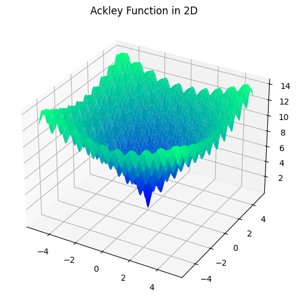
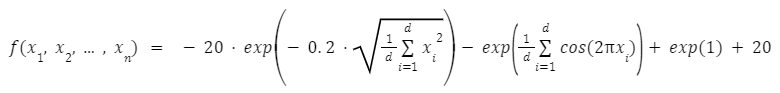

# Ackley Function

This is a non-convex function with many local optima around a single global minimum of zero<br/> at [0, 0, ... , 0].
This function implementation can be scaled to any number of dimensions depending on the number of inputs passed.



Form of the function is as follows: 



---

> *function* optiseek.testfunctions.**ackley**(*\*args*)

---

### Parameters

| Parameter | Description |
|---|---|
| \*args : *float* | Dynamic amount of x values for the function. The dimension of the function</br> adjusts to how many arguments are entered. |

---

### Example

```python
from optiseek.testfunctions import ackley

y = ackley(0, 0)
print(y)
```

```compile
0
```

---

### References

[List of Test Functions on Wikipedia](https://en.wikipedia.org/wiki/Test_functions_for_optimization)