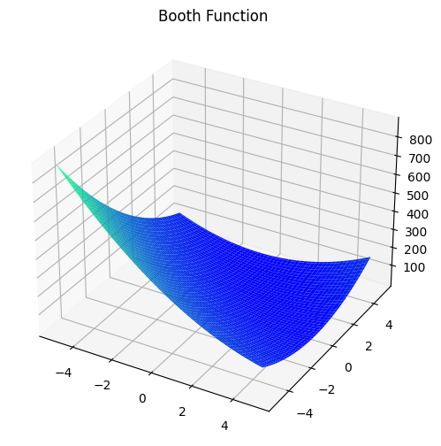
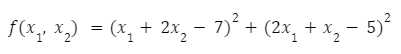

# Booth Function

This is a simple 2D quadratic function with a minimum of zero at [1, 3].



Form of the function is as follows: 



---

> *function* optiseek.testfunctions.**booth**(*x1, x2*)

---

### Parameters

| Parameter | Description |
|---|---|
| x1 : *float* | Input value for the first dimension. |
| x2 : *float* | Input value for the second dimension. |

---

### Example

```python
from optiseek.testfunctions import booth

y = booth(1, 3)
print(y)
```

```compile
0
```

---

### References

[List of Test Functions on Wikipedia](https://en.wikipedia.org/wiki/Test_functions_for_optimization)