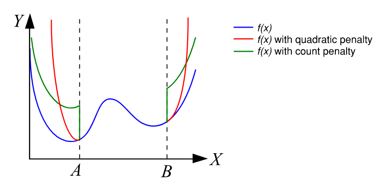
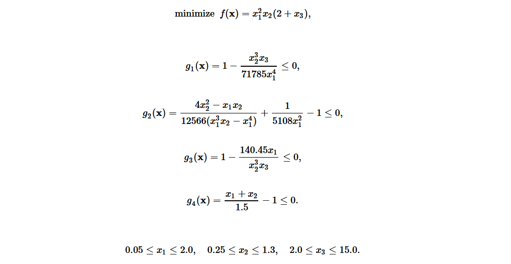

# Penalty Constraints

This function allows the user to apply constraints to an objective function as penalties and will return a new penalized function that can be optimized.
Both counted penalties and quadratic penalties can be enforced with this function.

Shown below is a representation of a 1D function *f(x)* and how it is penalized by both counted and quadratic constraints.
In this case, the constraints are that the function input *x* cannot be less than *A* or greater than *B*. With either of these constraint types, as soon as a
constraint is violated, the function value *y* has a penalty added to it. For the quadratic penalty, this penalty increases quadratically by the magnitude that 
the constraint is violated by. For the counted penalty, there is a fixed amount added to the function value for every penalty that is broken, regardless of the 
magnitude it is violated by.



It should be noted that the counted penalty creates a sharp discontinuity in the function, while the quadratic penalty is smooth. Typically, use of the quadratic penalty
will result in better convergence of the optimization algorithm; however, there are situations where the function value is optimal at
the location where a constraint is applied (like at *A* in the graphic above). In this case, the quadratic penalty multiplier will need to approach infinity
in order for the constraint to be properly enforced. In situations like this, it may be beneficial to use a moderate quadratic penalty with a small counted penalty.
Applying penalty constraints does not guarantee that the optimization algorithm will converge at a point within the constraints. Oftentimes, the penalty multipliers
must be tuned by the user to find out what works best.

Parameters of the `Optiseek` *penalty_constraints* function allow the user to control the magnitude of each of these penalties. 
Combinations of both of these penalty types can be applied at once with a single *penalty_constraints* function call. A value of zero will result in
no penalty of that type being applied to the returned penalized function. A higher value increases the step height for count penalties and increases the slope for
quadratic penalties. This tool will work for any function, whether the user would like to find the minimum or maximum.

---

> *function* optiseek.modelhelpers.**penalty_constraints**(*input_function, constraint_dict, find_minimum=True, p_quadratic=1, p_count=0*)

---

### Parameters

| Parameter | Description |
|---|---|
| input_function : *function* | Function object for the algorithm to optimize. |
| constraint_dict : *dict* | A dictionary that contains any number of constraint equations<br/> to be applied to the input function. The dictionary is structured<br/> like {constraint function: constraint type} where the constraints<br/> are compared to zero with a mathematical operator:<br/> g1(x) = 0, g2(x) < 0, etc. The constraint function must share<br/> the same arguments in the same order as the objective<br/> function. The constraint type must be one of the following<br/> strings: "<", "<=", ">", ">=", "=". See the example for more<br/> information.|
| find_minimum : *bool* | Indicates whether the optimimum of interest is a minimum<br/> or maximum. If true, looks for minimum. If false,<br/> looks for maximum. |
| p_quadratic : *float* | Penalty multiplier for the quadratic penalty in [0, inf]. A value of zero will<br/> result in no quadratic penalty to the objective function. A nonzero value<br/> smoothly penalizes the function according to the magnitude that the<br/> constraint is broken. Default value is 1.|
| p_count : *float* | Penalty multiplier for the count penalty in [0, inf]. A value of zero will<br/> result in no count penalty to the objective function. A nonzero value<br/> creates a sharp discontinuity where the constraint is broken. Default<br/> value is 0.|


---

### Returns

| Returns | Description |
|---|---|
| penalized_function : *function* | A function representing the input objective function with the<br/> constraints applied as penalties to the function value. |
| check_constraints : *function* | A function that, when passed some inputs, returns a list of booleans<br/> that represent whether each constraint was satisfied (True) or<br/> broken (False). Inputs to this function are the exact same as<br/> the input function. |

---

### Examples

##### Example 1:

We can demonstrate these constraints on a problem with several complex constraint equations to see it in action! Shown below is an engineering optimization problem
taken from an article by Xin-She Yang (see references) based on the properties of a spring. The function, its constraints, and the variable bounds are given.
Note that in this example, we choose to use a quadratic penalty multiplier of 2 and no counted penalty at all. Also note that the constraint functions must share the
same arguments in the same order as the input function.



```python
from optiseek.modelhelpers import penalty_constraints
from optiseek.metaheuristics import flying_foxes_algorithm

# create the function definition
def spring_problem(x1, x2, x3):
    return x1 ** 2 * x2 * (2 + x3)

# create the constraints as functions
def g1(x1, x2, x3):
    return 1 - (x2 ** 3 * x3) / (71785 * x1 ** 4)

def g2(x1, x2, x3):
    return (4 * x2 ** 2 - x1 * x2) / (12566 * (x1 ** 3 * x2 - x1 ** 4)) + 1 / (5108 * x1 ** 2) - 1

def g3(x1, x2, x3):
    return 1 - (140.45 * x1) / (x2 ** 3 * x3)

def g4(x1, x2, x3):
    return (x1 + x2) / 1.5 - 1

# create the constraint dictionary to define the constraint type
spring_constraint_dict = {g1: "<=",
                          g2: "<=",
                          g3: "<=",
                          g4: "<="}

# create a constrained version of the original function to be optimized
spring_problem_const, const_check = penalty_constraints(spring_problem,
                                                        spring_constraint_dict,
                                                        find_minimum=True,
                                                        p_quadratic=5000,
                                                        p_count=0)

# define variable list and search domain
var_list = [
    var_float('x1', [0.05, 2.0]),
    var_float('x2', [0.25, 1.3]),
    var_float('x3', [2.0, 15.0])
]

# instantiate an optimization algorithm with the constrained function and search domain
alg = flying_foxes_algorithm(spring_problem_const, var_list)

# optimize and check to make sure constraints are satisfied
alg.optimize(find_minimum=True, max_iter=500)
constraint_bools = const_check(*alg.best_position.values())

# show the results!
print(f'best_value = {alg.best_value:.5f}')
print(f'best_position = {alg.best_position}')
print(f'n_iter = {alg.completed_iter}')
print(f'constraint check: {constraint_bools}')
```

```profile
best_value = 0.01267
best_position = {'x1': 0.0517568175037568, 'x2': 0.35827540281247405, 'x3': 11.201295780064102}
n_iter = 500
constraint check: [True, True, True, True]
```

With this code, the best found solution found was approximately [0.0517, 0.358, 11.20].
A very high penalty constraint value was necessary, as the constraints made the search space much more complex.
We also used the constraint checking function created by the `penalty_constraints` helper to verify that our constraints were indeed satisfied with the best solution.
Note that this is not guaranteed to be the global optimum.

##### Example 2:

In this generic problem, the constraints require a bit more work to implement. 
The *constraint_dict* parameter for the penalty constraints function requires the constraints to be compared to zero.  
We must re-arrange the constraint equations to ensure this. 
Also, we can assume an upper bound on the search domain of 20 for each variable.

*Note: This is a linear problem, and could be easily solved with linear programming as well. However, it is a good example for re-arranging constraint functions.*

Minimize:  
*f(x, y, z) = -2x - 3y - 4z*

Subject to:   
*3x + 2y + z ≤ 10*	
*2x + 5y + 3z ≤ 15*		
*x, y, z ≥ 0*

Re-arranged constraints:   
*3x + 2y + z - 10 ≤ 0*	
*2x + 5y + 3z - 15 ≤ 0*		
*x, y, z ≥ 0*

```python
from optiseek.modelhelpers import penalty_constraints
from optiseek.metaheuristics import flying_foxes_algorithm

# create the function definition
def linear_function(x, y, z):
    return -2 * x - 3 * y - 4 * z

# create the constraints as functions
def g1(x, y, z):
    return 3 * x + 2 * y + z - 10

def g2(x, y, z):
    return 2 * x + 5 * y + 3 * z - 15

# create the constraint dictionary to define the constraint type
constraint_dict = {g1: "<=", g2: "<="}

# create a constrained version of the original function to be optimized
linear_function_const, const_check = penalty_constraints(linear_function,
                                                         constraint_dict,
                                                         p_quadratic=50000,
                                                         p_count=0)

# define variable list and search domain
var_list = [
    var_float('x', [0, 20]),
    var_float('y', [0, 20]),
    var_float('z', [0, 20])
]

# instantiate an optimization algorithm with the constrained function and search domain
alg = flying_foxes_algorithm(linear_function_const, var_list)

# optimize and check to make sure constraints are satisfied
alg.optimize(find_minimum=True, max_iter=200)
constraint_bools = const_check(*alg.best_position.values())

# show the results!
print(f'best_value = {alg.best_value:.5f}')
print(f'best_position = {alg.best_position}')
print(f'n_iter = {alg.completed_iter}')
print(f'constraint check: {constraint_bools}')
```

```profile
best_value = -19.99982
best_position = {'x': 0.0, 'y': 0.0, 'z': 4.9999547568628735}
n_iter = 200
constraint check: [True, True]
```

With this code, it can be found that the best solution is approximately *f(0, 0, 5) = -20*.

---

### References

*Algorithms for Optimization by Kochenderfer and Wheeler, Chapter 10.7*

[Spring Example Problem by Xin-She Yang](http://www.scholarpedia.org/article/Metaheuristic_Optimization)